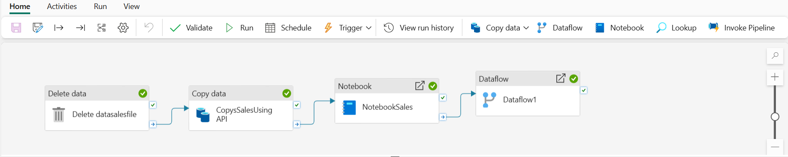

# 🚀 End-to-End Data Engineering with Microsoft Fabric

This project demonstrates how to build a complete **end-to-end data engineering pipeline** using **Microsoft Fabric**, covering data ingestion, transformation, and modeling for analytics.

---

## 📌 Project Overview

This pipeline simulates a real-world data engineering workflow:

* 🔹 Data ingestion from API into Lakehouse
* 🔹 Data transformation using Notebooks and Dataflows Gen2
* 🔹 Data modeling using Fact and Dimension tables
* 🔹 Ready for visualization in Power BI

---

## 🏗️ Architecture



---

## ⚙️ Pipeline Workflow

The pipeline consists of the following steps:

1. **Delete existing data**

   * Clears previous dataset to ensure fresh load

2. **Copy Data (API Ingestion)**

   * Extracts sales data via API into Lakehouse

3. **Notebook Processing**

   * Cleans and prepares raw data
   * Writes processed data into staging tables

4. **Dataflow Transformation**

   * Applies transformations and prepares structured dataset

---

## 🧱 Data Warehouse Design

This project follows a **Star Schema** approach:

### 🔹 Fact Table

* `Fact_Sales`

  * Stores transactional data such as orders, quantity, and pricing

### 🔹 Dimension Tables

* `Dim_Customer`
* `Dim_Item`

---

## 🗃️ SQL Components

### ✔️ Schema Creation

* Creates `Sales` schema
* Defines Fact and Dimension tables

### ✔️ Stored Procedure

* `LoadDataFromStagingLakehouse`
* Loads data from staging into:

  * Dimension tables (deduplicated)
  * Fact table

---

## 🔑 Key Concepts Demonstrated

* Data ingestion using Microsoft Fabric pipelines
* Lakehouse-based architecture
* ETL/ELT pipeline design
* Star schema modeling
* Use of **NOT ENFORCED primary keys** in analytics systems
* Data deduplication using SQL (`NOT EXISTS`)
* Data transformation using Notebooks & Dataflows

---

## 🛠️ Tools & Technologies

* Microsoft Fabric

  * OneLake
  * Lakehouse
  * Dataflows Gen2
  * Notebooks
* SQL (T-SQL)
* Git & GitHub

---

## 📂 Project Structure

```
├── image/
│   └── pipeline screenshot
├── sales.csv
├── SchemaFact&DimTablesQueryFabric.sql
├── LoadDataFromStagingLakehouse.sql
└── README.md
```

---

## 💡 Learnings

* Designed a scalable data pipeline using Microsoft Fabric
* Implemented data warehouse modeling using Fact & Dimension tables
* Understood trade-offs of **NOT ENFORCED constraints**
* Applied clean SQL coding practices and version control

---

## 🚀 Future Improvements

* Add surrogate keys for dimension tables
* Implement incremental loading
* Add data validation layer
* Integrate Power BI dashboard

---

## 👨‍💻 Author

**Akhmal Aj**
